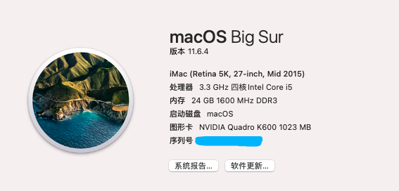

EFI

z220 sff + k600 + e3-1230v2

GitHub: https://github.com/clibing/EFI-z220sff-OpenCore

Big Sur 11.6.4 OpenCore 0.7.8

````
CPU: e3-1230v2
Graphics Card: K600 1024G
Ethernet: Intel 82579LM 
WiFi: AX210 + BT 5.2
SATA: WDC(240G) + 1T
Audio: C216(alcid=11)
Memory: 8Gx3

display: dell
````

result:



